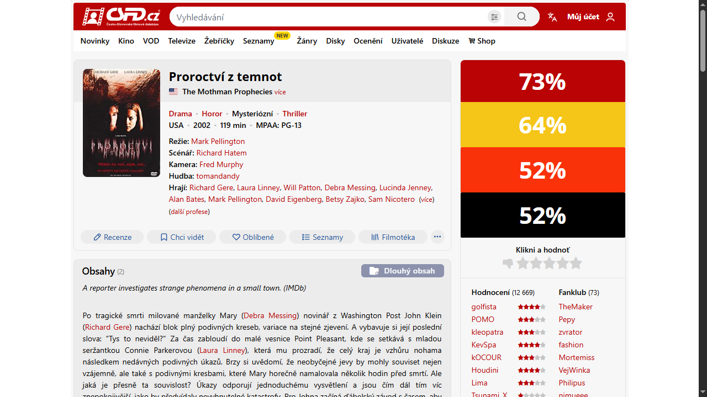
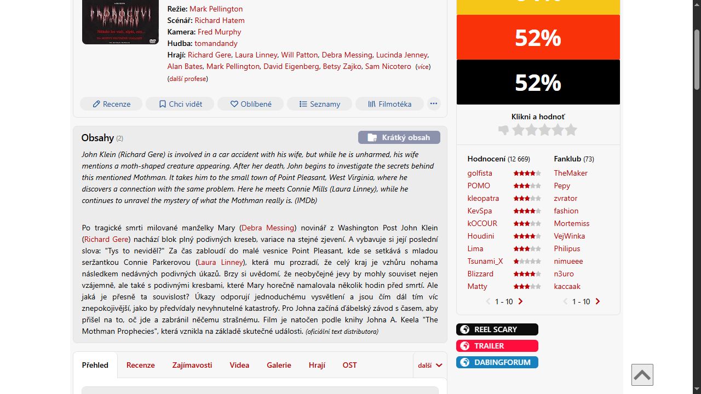

# ČSFD Extended

Tampermonkey script that extends ČSFD title pages with additional useful information.

---

## 📌 Overview

ČSFD gives you the local view, but sometimes it's interesting to see a title from a different angle. This script adds a few extra details from another sources to make browsing on this website a bit more convenient.

---

## 🛠 Tech Stack

- **Language:** JavaScript
- **Library:** jQuery
- **API:** OMDb API
- **Platform:** Tampermonkey

---

## 📸 Screenshots

---

## 🚀 Features

- IMDb plot with short/full toggle
- MPAA rating
- IMDb, Rotten Tomatoes, and Metascore ratings
- Quick links updated (Trailer, DabingForum, Reel Scary for horror films)
- OMDb API response caching
- Automatic expansion of shortened plots

---

## 📦 Installation

1. Install [Tampermonkey](https://www.tampermonkey.net) for your browser.
2. [Click here to install the script](https://github.com/mk-forge/csfd-extended/raw/main/csfd-extended.user.js) – Tampermonkey will open and ask you to confirm the installation.
3. Replace `PUT YOUR API KEY HERE` with your own OMDb API key (get one at [omdbapi.com/apikey.aspx](https://omdbapi.com/apikey.aspx)).
4. Enjoy the script! 🚀
